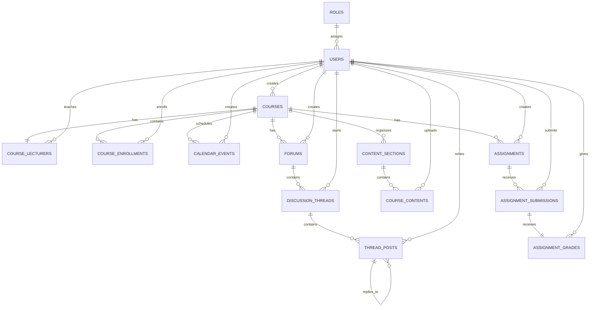

# ERD

```mermaid
erDiagram
    ROLES ||--o{ USERS : assigns
    USERS ||--o{ COURSES : creates
    COURSES ||--|| COURSE_LECTURERS : has
    USERS ||--o{ COURSE_LECTURERS : teaches
    COURSES ||--o{ COURSE_ENROLLMENTS : contains
    USERS ||--o{ COURSE_ENROLLMENTS : enrolls
    COURSES ||--o{ CALENDAR_EVENTS : schedules
    USERS ||--o{ CALENDAR_EVENTS : creates
    COURSES ||--o{ FORUMS : has
    USERS ||--o{ FORUMS : creates
    FORUMS ||--o{ DISCUSSION_THREADS : contains
    USERS ||--o{ DISCUSSION_THREADS : starts
    DISCUSSION_THREADS ||--o{ THREAD_POSTS : contains
    THREAD_POSTS ||--o{ THREAD_POSTS : replies_to
    USERS ||--o{ THREAD_POSTS : writes
    COURSES ||--o{ CONTENT_SECTIONS : organizes
    CONTENT_SECTIONS ||--o{ COURSE_CONTENTS : contains
    USERS ||--o{ COURSE_CONTENTS : uploads
    COURSES ||--o{ ASSIGNMENTS : has
    USERS ||--o{ ASSIGNMENTS : creates
    ASSIGNMENTS ||--o{ ASSIGNMENT_SUBMISSIONS : receives
    USERS ||--o{ ASSIGNMENT_SUBMISSIONS : submits
    ASSIGNMENT_SUBMISSIONS ||--|| ASSIGNMENT_GRADES : receives
    USERS ||--o{ ASSIGNMENT_GRADES : gives
```
